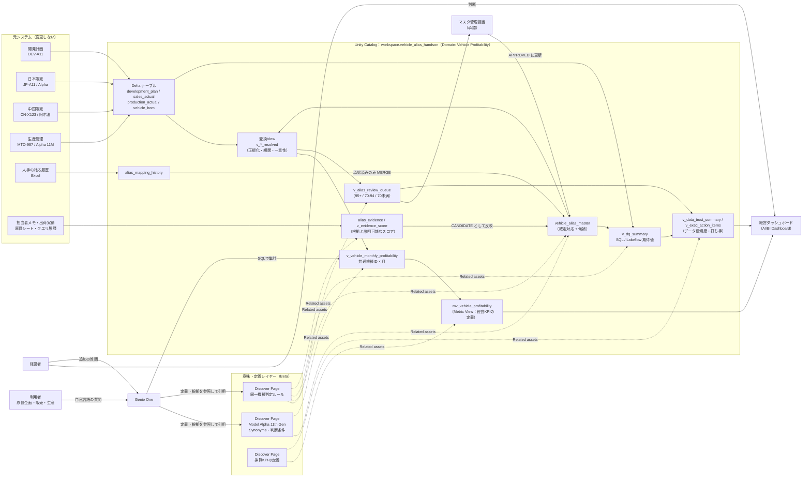

# 名称・コードが違っても「同じ車両」として集計する
## Unity Catalog Discover Pages × Genie One × Delta Lake ハンズオン（車種別採算編）

> **重要なお知らせ**
> - **Discover Pages は Beta 機能**です。画面構成・項目名・Genie One との連携動作・API は予告なく変わる可能性があります。本番導入を検討する前に、必ず最新の Databricks ドキュメントとワークスペースで仕様を確認してください。Unity Catalog Domains、Genie One も、ワークスペースによってはプレビュー段階の場合があります。
> - 本ハンズオンのデータ（車両名・コード・部署名・数値・資料名）はすべて**架空**です。実在する企業の機密データは使っていません。
> - Page には**機密原価、個人情報、規制対象データを書きません**。金額は、権限管理されたDeltaテーブルからのみ取得します。

---

## 1. タイトルと概要

**タイトル：** 「阿尔法も Alpha も MTO-987 も同じ車」― 共通機種IDで計画・販売・生産をつなぐハンズオン

**概要：**
新機種1台あたりの収益・コストの積み上げには、多くの時間がかかります。主な原因は、国・部門・システムごとに車種名称と機種コードが異なり、データの粒度もばらばらであることです。

このハンズオンでは、架空の車両「Model Alpha 11th Gen」を題材に、次の3つの仕組みの役割分担を体験します。

| 仕組み | 役割 |
|---|---|
| **Delta の対応表（`vehicle_alias_master`）** | コードを共通機種IDへ**確定的に**変換し、計画・販売・生産を結合する |
| **Discover Pages** | 「どれが同じ車か」「なぜそう判断するか」という**業務上の意味と根拠**を人と Genie に伝える |
| **Genie One** | Page の定義を優先して質問を解釈し、Page を根拠として引用しながら答える |

**Pageを書くだけでは、データの結合やコード変換は自動実行されません。**確定的な集計には必ず Delta の対応表を使います。この点がハンズオン全体を通じた一番のメッセージです。

**最終的なゴールは、経営者が判断できる材料を画面にそろえることです。**「データの種類や業務定義をすべて整えてからダッシュボードを作る」のではなく、「経営者の問いから逆算して必要な部分だけを整え、数字がどこまで信用できるか（データ信頼度）も一緒に見せる」進め方を、2回に分けて体験します。

| 回 | テーマ | 経営者の画面との関係 |
|---|---|---|
| 第1回（90分） | データの土台：共通機種ID・Page・Genie・品質ルール | 経営ダッシュボードの数字が「どこから来て、なぜ信用できるか」 |
| 第2回（90分） | 経営判断の材料：根拠の収集・効果試算・KPI定義・経営ダッシュボード | 経営者が「儲かっているか」「どこに手を打つか」を判断する画面 |

第1回の冒頭で、第2回で作る**完成した経営ダッシュボードを先に見せ**、「この数字を作るまで」を演習で体験する構成にしています。

---

## 2. 対象者・前提条件・所要時間

### 対象者
- 原価企画・経営管理・販売企画・生産管理・IT部門で、車種別採算の集計に関わる方
- SQL の基礎（SELECT / JOIN / GROUP BY）を理解している方。Databricks の経験は問いません。

### 前提条件

**Databricks Free Edition でそのまま実施できます。**カタログ・スキーマ名は `config/00_config`（ノートブック `00_config`）の1か所で管理します。既定値は Free Edition の既定カタログ `workspace` と、スキーマ `vehicle_alias_handson` です。

| 項目 | Free Edition | 社内・顧客のワークスペース |
|---|---|---|
| ワークスペース | Free Edition に登録するだけ（Unity Catalog は最初から有効） | Unity Catalog が有効 |
| コンピュート | ノートブックは Serverless、SQL エディタは既定の Serverless Starter Warehouse | Serverless 推奨（2X-Small で十分） |
| カタログ | 既定の `workspace` をそのまま使う（`00_config` の変更は不要） | 講師がカタログを作成し、`00_config` の `catalog` を変更する。参加者に `USE CATALOG`、`CREATE SCHEMA` を付与 |
| スキーマ | `00_config` が自動で作成する | 同左。複数人で使う場合は `schema` を人ごとに変える |
| Discover Pages / Domains / Genie One | **Beta・プレビュー機能のため、Free Edition で使えない場合があります。**使えない場合は Exercise 3 の「SQLによる代替手順」と、Genie スペース（AI/BI Genie）で代わりに体験します | ワークスペース管理者が有効化し、Domain `Vehicle Profitability` を作成しておく |
| AI Functions | 任意（Exercise 5-6）。使えない場合は飛ばす | 任意 |
| Lakeflow | 任意（Exercise 6）。Serverless のパイプラインで実行 | 任意 |

社内ワークスペースで参加者に権限を付与する例（`<catalog>` と `<schema>` は `00_config` の値）：
```sql
GRANT USE CATALOG, CREATE SCHEMA ON CATALOG <catalog> TO `handson_participants`;
GRANT USE SCHEMA, SELECT, EXECUTE ON SCHEMA <catalog>.<schema> TO `handson_participants`;
```

### 所要時間（2回構成・各90分）

**第1回：データの土台をつくる**

| # | 内容 | 時間 |
|---|---|---|
| 0 | オープニング：完成した経営ダッシュボードを見せる | 5分 |
| 0 | イントロ（課題）と準備 | 5分 |
| 1 | Exercise 1：分断されたデータを確認する | 10分 |
| 2 | Exercise 2：Excel の履歴を取り込み、共通機種IDで統合する | 25分 |
| 3 | Exercise 3：Discover Page を作成する | 10分 |
| 4 | Exercise 4：Genie One で質問する | 10分 |
| 5 | Exercise 5：曖昧・未解決データを扱う | 10分 |
| 6 | Exercise 6：データ品質問題を検出する | 10分 |
| — | まとめ（第1回） | 5分 |

**第2回：経営判断の材料をそろえる**

| # | 内容 | 時間 |
|---|---|---|
| 0 | 第1回の振り返りと準備（必要な人は `10_session2_catchup` を実行） | 5分 |
| 5B | Exercise 5B：根拠を集めて未解決コードを候補にする | 15分 |
| 7 | Exercise 7：業務効果を試算する | 10分 |
| 8 | Exercise 8：経営ダッシュボードで判断する | 50分 |
| — | まとめ（全体）・質疑 | 10分 |

**短縮する場合：**第1回は、Exercise 2 の 2-3（名称正規化）を講師デモにし、Exercise 5 の 5-5・5-6 と Exercise 6 の Lakeflow を省略します。第2回は、Exercise 8-4 を講師デモ（08b の実行のみ）にします。

### 実施形態

- **データとSQL（Exercise 1, 2, 5, 6, 7）：**Free Edition では、各自のワークスペースで既定値のまま実施します。1つのワークスペースを共有する場合は、`00_config` の `schema` を `vehicle_alias_handson_<イニシャル>` に変えてから実施します。
- **Page（Exercise 3）：**同じ Synonyms を持つ公開Pageが複数あると、Genie One がどれを使うべきか判断できなくなります。そのため、**公開は講師が1つだけ行います**。参加者は下書きの作成までを体験します。参加者が多い場合は、4〜5名のチームで1つの下書きを作る進め方でもかまいません。
- **Genie One（Exercise 4）：**全員が、講師が公開したPageと講師のスキーマを対象に質問します（Free Edition では各自のPageとスキーマ）。
- **完成形の事前準備（講師）：**第1回の冒頭で見せるため、講師は事前に自分のスキーマで第1回・第2回のノートブックをすべて実行し、経営ダッシュボードを配置しておきます（`08b` まで。`08c` の承認は、第2回の本番で見せるため実行しないでおきます）。
- **第2回の準備：**第1回と同じスキーマで続けるのが基本です。第1回を欠席した方、データを消した方は、第2回の最初に `10_session2_catchup` を実行すると、第1回の最後と同じ状態を再現できます。

### ファイル構成

```
README.md                              本ガイド（手順・期待値・講師ノート）
config/00_config.py                    カタログ・スキーマ名の設定（各ノートブックが %run で読み込む）
sql/00_setup_tables_and_data.sql       DDL・INSERT・正規化関数・タグ（過去の人手承認履歴は Exercise 2-0 で Excel から取り込む）
data/alias_mapping_history.xlsx       過去の人手承認履歴のサンプル Excel（架空。Exercise 2-0 で Volume に置いて取り込む）
data/alias_mapping_history.csv        同じ内容の CSV（SQL エディタで read_files を使って取り込む場合）
notebook_snippets/02_ingest_history_excel.py  Exercise 2-0 のノートブック版（Excel を Volume から取り込む Python）
sql/01_ex1_siloed_data.sql             Exercise 1
sql/02_ex2_mapping_and_views.sql       Exercise 2（履歴取込・変換View・採算View）
sql/05_ex5_review_queue.sql            Exercise 5（信頼度分類・承認・監査）
sql/05b_ex5b_evidence_candidates.sql   Exercise 5B（根拠の収集・スコア・候補化）
sql/06_ex6_data_quality.sql            Exercise 6（品質チェック・CHECK制約）
sql/07_ex7_effort_estimate.sql         Exercise 7（効果試算）
sql/08_ex8_exec_kpi.sql                Exercise 8-1〜8-3（Metric View・データ信頼度・打ち手の一覧）
sql/08c_ex8_approve_and_refresh.sql    Exercise 8-6（承認がダッシュボードに反映されることを確認）
dashboard/vehicle_profitability.lvdash.json  経営ダッシュボードの定義（08b が使う）
notebook_src/08b_ex8_deploy_dashboard.py     Exercise 8-4（ダッシュボードの作成・更新・公開）
notebook_src/10_session2_catchup.py          第2回の準備（第1回の結果を再現）
sql/99_cleanup.sql                     後片付け
pages/01_model_alpha_11th_gen.md       車両Page の完成版本文
pages/02_same_vehicle_rules.md         「同一機種判定ルール」Page の完成版本文
pages/03_profitability_kpi_definitions.md  「採算KPIの定義」Page の完成版本文（第2回）
pipelines/dq_expectations_pipeline.sql （任意）Lakeflow 期待値による品質ルール
notebooks/*.ipynb                      上記 SQL・Page 本文・本ガイドの Databricks ノートブック版
tests/98_verify_expected_values.py     （講師用）ガイドの期待値と実際の結果を自動で照合するチェック
tools/build_notebooks.py               sql/・pages/・config/・notebook_src/・notebook_snippets/・tests/・dashboard/・README.md から notebooks/ を再生成するスクリプト
tools/make_sample_files.py             data/ のサンプル Excel・CSV を作り直すスクリプト（openpyxl が必要）
```

### 始め方（ノートブック版・推奨）

1. `notebooks/` フォルダの中身を、ワークスペースの同じフォルダにまとめてインポートします。
   - 画面から：Workspace → 自分のフォルダ → ︙ → **インポート** → `.ipynb` を選択（すべて同じフォルダに入れる）
   - Git から：Workspace → 作成 → **Git フォルダ** → このリポジトリの URL を指定（`notebooks/` がそのまま使えます）
   - CLI から：`databricks workspace import-dir notebooks /Users/<自分のメール>/vehicle-alias-handson`
2. 必要なら `00_config` を開き、`CONFIG` の `catalog` / `schema` を変更します（**Free Edition では変更不要**）。
3. `00_setup_tables_and_data` を開き、コンピュートに **Serverless** を選んで「すべて実行」します。
4. 以降の Exercise のノートブックを、所要時間の表の順に開いて実行します（第1回：01 → 02 → 05 → 06、第2回：05b → 07 → 08 → 08b → 08c）。

各ノートブックの先頭セル `%run ./00_config` が設定を読み込み、スキーマを作成します。ノートブックの SQL は `run_sql()`（`00_config` で定義）で実行します。テーブル・View・関数の名前には `00_config` のカタログ・スキーマが自動で付く（例：`sales_actual` → `workspace.vehicle_alias_handson.sales_actual`）ので、`USE` の状態やコンピュートの種類に左右されません。**各ノートブックでは、最初に `%run ./00_config` のセルを実行してください。**ジョブから実行する場合は、パラメータ `catalog` / `schema` / `warehouse_id` / `dashboard_parent_path` を渡すと設定値より優先されます。

**SQL エディタで実施する場合：**`sql/*.sql` の冒頭にある `-- @config-begin` 〜 `-- @config-end` の `USE` 文を、`00_config` と同じ値に書き換えてから実行します。

**ノートブックの解説：**各ノートブックのセルの前には、「💡 解説」として、なぜその実装にするのか（なぜ）、技術的な仕組み（仕組み）、得られる利点（利点）を書いています。SQL エディタ版では、同じ内容が SQL ファイルのコメント（`-- 💡`）として入っています。

**講師の事前確認：**第1回（`00_setup` → `01` → `02` → `05` → `06`）と第2回（`05b` → `07` → `08` → `08b` → `08c`）をすべて実行した後に `98_verify_expected_values` を実行すると、ガイドに書いた期待値（32項目）と一致するかを確認できます。確認が終わったら `00_setup` から実行し直し、`08b` まで実行した状態にしておきます（第1回の冒頭で見せる完成形になります）。

**メンテナンス：**SQL・Page 本文・設定を修正したら、`python3 tools/build_notebooks.py` でノートブックを再生成します。

---

## 3. 完成アーキテクチャ



**ポイント**
- 実線は**データの流れ**（確定的な処理）、点線は**意味の付与**（Pageは説明と根拠を与えるもので、データは変換しない）を表します。
- 元システムには属性を追加しません。対応関係はすべて Databricks 側の Delta テーブルで管理します。
- AI 候補は `CANDIDATE` のまま置いておき、人が承認して初めて `APPROVED` になり、集計に使われます。

---

## 4. サンプルデータの設計

### 車両（共通機種）

| 共通機種ID | グローバル名称 | 位置づけ |
|---|---|---|
| **VEHICLE-001** | **Model Alpha 11th Gen** | 主役 |
| VEHICLE-002 | Model Alpha 10th Gen | 先代。**同じ名称「Alpha」**を使っている（名称だけでは判定できないことを示す） |
| VEHICLE-003 | Model Alpha 11th Gen EV | 同じ世代の派生EVだが、**別の開発プロジェクト**なので別機種 |
| VEHICLE-004 | Model Beta 3rd Gen | 別の系列。似たコード `CN-X128` を持つ |

### 別名（VEHICLE-001）

| 領域 | 名称 | コード |
|---|---|---|
| 日本販売 | Alpha | JP-A11 |
| 中国販売 | 阿尔法 | CN-X123（2025-06〜） / CN-X123B（〜2025-05、旧システム） |
| 開発計画 | Project A11 | DEV-A11 |
| 生産管理 | Alpha 11M | MTO-987 |

### 対応づけのケース

| ケース | データ | 期待する扱い |
|---|---|---|
| 完全一致 | `JP-A11`, `CN-X123`, `DEV-A11`, `MTO-987` | 自動で変換 |
| 表記揺れの正規化 | `jp-a11 `（S006）, `ＪＰ－Ａ１１`（S009）, `mto-987 `（P003）, 名称 `ALPHA 11 M`, `Ａｌｐｈａ　１１Ｍ` | 正規化して変換 |
| 過去の承認履歴 | `CN-X123B`（H001）。各部署が人手で作った Excel（`data/alias_mapping_history.xlsx`）にある | Volume に置いた Excel を取り込み、承認済みの履歴を対応表に取り込んで変換 |
| 高信頼の候補 | `JP-A11-SE`（96点） | 自動承認候補（人が承認して確定） |
| 候補が1つ（中程度の信頼度） | `MTO-988`（91点） | 人による確認 |
| 候補が複数 | `CN-X12`（82点 VEHICLE-001 / 78点 VEHICLE-004） | 人による確認 |
| 低信頼 | `TH-Z999`（45点） | 未解決 |
| 対応表に存在しない | `KR-Q777` | 未解決（候補なし） |
| 根拠を集めて候補化（5B） | `TH-Z999`：担当者メモ・出荷実績・原価シート・クエリ履歴 → 88点 | 要確認（人が根拠を見て判断） |
| 根拠が不足（5B） | `KR-Q777`：担当者メモ・原価シートのみ → 40点、別の車両（Model Beta）を示す弱い根拠も1件 | 未解決のまま。次に集める根拠（出荷記録）を示す |
| マスタの矛盾 | `MTO-990` が2つの共通機種IDに確定登録 | 集計から除外し、要確認 |
| 必須項目の欠損 | A019（コード・適用期間なし） | 品質ルールで検出 |
| BOM の不正 | MTO-987 のタイヤが 4本＋旧版2本＝6本、12Vバッテリーの二重取込 | 品質ルールで検出 |

**単位：**金額は百万円、台数は台（いずれも架空）。対象期間は 2025-04〜2025-09 の6か月です。

---

## 5. Exercise 手順

### ◆ 第1回：データの土台をつくる（90分）

### オープニング：完成した経営ダッシュボードを見せる（5分・講師）

講師が事前に配置しておいた「車種別採算 経営サマリ（ハンズオン）」を画面共有します。

1. 上段の KPI：「実績売上は計画比 約 −9%」「材料費は期間合計では計画内だが、8月だけ +490 百万円の超過」「1台あたりの簡易限界利益が計画を下回っている」
2. 右上の**データ信頼度**：「集計に入っていない売上がまだ約 500 百万円ある」「重要な品質ルール違反がある」
3. 打ち手の一覧：「8月の材料費超過 → 部品表の重複を確認」「未確定のコード → 承認・根拠集め」

そのうえで、次のように問いかけます。**「この画面の数字は、国・部門・システムごとにばらばらなコードをどうやって1つの車種にまとめ、なぜ信用できると言えるのか。第1回はその土台を、第2回はこの画面そのものを作ります」**

---

### Exercise 0：準備（講師は事前、参加者は開始時に3分）

1. 「始め方」のとおり、ノートブックをワークスペースにインポートします。
2. 必要なら `00_config` の `catalog` / `schema` を変更します（Free Edition では変更不要）。
3. `00_setup_tables_and_data` を Serverless で「すべて実行」します。`%run ./00_config` のセルに `✅ 使用するスキーマ: workspace.vehicle_alias_handson` と表示され、最後の件数確認が **4 / 19 / 9 / 26 / 11 / 12** になれば完了です（過去の人手承認履歴は、Exercise 2-0 で Excel から取り込みます）。

SQL エディタで実施する場合は、`sql/00_setup_tables_and_data.sql` を貼り付け、`@config` の範囲の `USE` 文と `CREATE SCHEMA` を自分の値に書き換えてから実行します。

---

### Exercise 1：分断されたデータを確認する（10分）

**目的：**コードが違うため、計画・販売・生産をそのまま結合できないことを体験します。

**手順：**`sql/01_ex1_siloed_data.sql` を上から1ブロックずつ実行します。

| ステップ | 操作 | 確認すること |
|---|---|---|
| 1-1 | システムごとのコード一覧 | 開発は `DEV-A11`、販売は `JP-A11`/`CN-X123`、生産は `MTO-987`。同じ車でも共通のキーがない |
| 1-2, 1-3 | コードでそのまま JOIN | **0件**になる |
| 1-4 | 名称「Alpha」で検索 | VEHICLE-001 と VEHICLE-002 の**2世代**がヒットする。名称だけでは結合できない |
| 1-5 | 日本販売コードの完全一致 | `jp-a11 ` や `ＪＰ－Ａ１１` は `false`。人が目で見れば同じでも、システム上は別の値 |
| 1-6 | 月あたりの行数 | 販売は月に3行（日本2＋中国1）、生産・計画は1行。**粒度が違う** |

**確認ポイント**
- [ ] 計画・販売・生産を結合できる共通のキーがないことを説明できる
- [ ] 名称で結合すると別の世代まで混ざる理由を説明できる

**講師の説明ポイント**
- 「コスト積み上げの作業のうち、この“どれとどれが同じか”を調べる作業に多くの時間がかかっています」と、課題の中心であることを伝えます。
- 元システムに「共通機種ID」の列を追加できれば簡単ですが、既存のホストシステムでは難しいという前提を確認します。だから Databricks 側に対応表を持ちます。

---

### Exercise 2：共通機種IDで統合する（25分）

**目的：**`vehicle_alias_master` を使って、異なるコードを共通機種IDに変換し、計画・販売・生産を横断するViewを作ります。

**手順：**ノートブック `02_ex2_mapping_and_views` を上から順に実行します。最初の 2-0 で、過去の人手承認履歴（Excel）を Volume に置いて取り込みます。

| ステップ | 操作 | 期待値 |
|---|---|---|
| 2-0 | 過去の人手承認履歴（Excel）を Volume に置いて取り込む。Volume `handson_files` を作り、`data/alias_mapping_history.xlsx` をアップロードする（Git フォルダから実行している場合は自動でコピーされる）。見出しが3行目の Excel を読み、Delta テーブル `alias_mapping_history` に保存する | 5行。`source_file` 列に Volume 上の Excel のパスが入る |
| 2-1 | 正規化関数を試す | `ＪＰ－Ａ１１`・`jp-a11 ` → `JPA11`、`Ａｌｐｈａ　１１Ｍ` → `ALPHA11M`、`阿爾法`（繁体字）は `阿尔法`（簡体字）と一致しない |
| 2-2 | 完全一致だけで変換した場合 | 26行中 **18行（69.2%）**しか変換できない |
| 2-3 | 名称だけの過去履歴を正規化して照合 | H002/H003 は VEHICLE-001 に一意に決まる。H004 `alpha` は **2候補（要確認）**、H005 `阿爾法` は**未解決** |
| 2-4 | 承認済みの過去履歴を対応表に MERGE | `HIST-H001`（CN-X123B → VEHICLE-001、〜2025-05-31）が追加される |
| 2-5, 2-6 | 変換View `v_alias_approved`、`v_sales_resolved`、`v_production_resolved`、`v_plan_resolved` を作成 | 内訳で `EXACT` / `NORMALIZED` / `HISTORY` のどれで解決したかが分かる |
| 2-7 | 採算View `v_vehicle_monthly_profitability` を作成 | — |
| 2-8 | VEHICLE-001 の月次採算を表示 | 下の表 |
| 2-9 | 集計から除外されたレコード | 販売4行＋生産2行 |

**2-8 の期待値（VEHICLE-001、Exercise 5 の承認前）**

| 月 | 計画台数 | 販売台数 | 生産台数 | 計画売上 | 実績売上 | 売上差額 | 計画材料費 | 実績材料費 | 材料費差額 |
|---|---:|---:|---:|---:|---:|---:|---:|---:|---:|
| 2025-04 | 3,500 | 3,100 | 3,300 | 10,500 | 9,340 | -1,160 | 6,300 | 6,110 | -190 |
| 2025-05 | 3,500 | 3,180 | 3,350 | 10,500 | 9,580 | -920 | 6,300 | 6,200 | -100 |
| 2025-06 | 3,600 | 3,260 | 3,400 | 10,800 | 9,820 | -980 | 6,480 | 6,320 | -160 |
| 2025-07 | 3,600 | 3,280 | 3,420 | 10,800 | 9,852 | -948 | 6,480 | 6,350 | -130 |
| 2025-08 | 3,700 | 3,350 | 3,500 | 11,100 | 10,070 | -1,030 | 6,660 | **7,150** | **+490** |
| 2025-09 | 3,800 | 3,470 | 3,550 | 11,400 | 10,430 | -970 | 6,840 | 6,600 | -240 |
| **合計** | 21,700 | 19,640 | 20,520 | 65,100 | 59,092 | -6,008 | 39,060 | 38,730 | **-330** |

（金額は百万円・架空。2025-08 の1台当たり実績材料費は 2.043 で、計画の 1.800 を大きく上回っています。）

**確認ポイント**
- [ ] 元テーブルを一切変更せずに、共通機種IDで結合できた
- [ ] 旧世代の `JP-A10`（S019）と派生EVの `JP-A11E` は VEHICLE-001 に**含まれていない**
- [ ] `MTO-990` は `CONFLICT` として**集計から除外**されている（誤って結合されていない）
- [ ] 各系列を「共通機種ID × 月」に集計してから結合する理由を説明できる

**講師の説明ポイント**
- **粒度をそろえてから結合します。**販売（パワートレイン単位）と生産（MTO単位）を明細のまま結合すると行が掛け算で増え、金額が二重に計上されます。これは部品表の重複で「タイヤが6本」になるのと同じ種類の問題です（Exercise 6）。
- 変換のルールは4つです。①業務領域の一致、②正規化したコードの一致、③適用期間内であること、④候補が1つに絞れること。④を満たさないものは結合せず、要確認として残します。
- 過去の Excel は変更せず、承認済みで根拠があるものだけを取り込みます。取込元と承認者は記録として残ります。

---

### Exercise 3：Discover Page を作成する（10分）

**目的：**「Model Alpha 11th Gen が何か」「何が同じで、何が違うか」を正式な業務定義として登録し、Genie One に与えます。

> **Beta 機能の注意：**以下の画面操作は執筆時点の想定です。メニュー名・配置は変わる可能性があります。見つからない場合は講師に確認するか、後述の「SQLによる代替手順」を使ってください。

#### 3-A. Page 公開**前**のベースラインを記録する（3分）
Exercise 4 の質問のうち **Q1〜Q3 と Q6** を Genie One に入力し、回答を下の記録シートに書き留めます（講師が代表して画面共有してもかまいません）。

| 質問 | 公開前の回答（要旨） | 引用された根拠 | 公開後の回答（要旨） | 引用された根拠 |
|---|---|---|---|---|
| Q1 阿尔法とAlphaは同じ？ | | | | |
| Q2 CN-X123 の日本コード | | | | |
| Q3 MTO-987 の開発名称 | | | | |
| Q6 対応関係の根拠 | | | | |

#### 3-B. 車両 Page を作成する（8分）
1. 左のサイドバーの **Catalog**（カタログエクスプローラー）から **Discover** を開きます。
2. **Domains** から **Vehicle Profitability** を選びます。
3. **Page を作成**（New page）をクリックします。
4. `pages/01_model_alpha_11th_gen.md` の「登録フィールド」にしたがって入力します。
   - **Page 名**：`Model Alpha 11th Gen`
   - **Description**：国・部門・システムによって異なる名称とコードを持つ同一車両系列の正式な業務定義
   - **Synonyms**：`Alpha`、`阿尔法`、`Project A11`、`Alpha 11M`、`JP-A11`、`CN-X123`、`DEV-A11`、`MTO-987` を1つずつ追加
   - **本文**：「本文」セクションを丸ごと貼り付け
   - **Related assets**：`vehicle_alias_master`、`canonical_vehicle`、`development_plan`、`sales_actual`、`production_actual`、`v_vehicle_monthly_profitability`、`v_alias_review_queue` を追加
   - **Sources**：仕様管理資料（架空）と `vehicle_alias_master` を追加
5. 参加者は**下書きとして保存**します。講師は、講師のスキーマを参照する Page を**公開**します。

#### 3-C. 「同一機種判定ルール」Page を作成する（講師が公開、参加者は内容を確認）（4分）
`pages/02_same_vehicle_rules.md` の内容で登録します。車両Pageの本文からこのPageを参照しているので、Genie は「なぜ同じと言えるのか」を聞かれたときにこのPageも根拠にできます。

#### SQLによる代替手順（Page の画面が使えない場合）
Page の代わりにはなりませんが、Unity Catalog のコメントとタグで意味を補うことができます。Genie One はテーブルやViewのコメントも参考にします。

```sql
-- 00_config で USE 済みのノートブック / SQL エディタで実行（別スキーマの場合は <catalog>.<schema>. を付ける）
COMMENT ON TABLE vehicle_alias_master IS
'車両名称・機種コードの確定対応表。Model Alpha 11th Gen（VEHICLE-001）の別名: Alpha / 阿尔法 / Project A11 / Alpha 11M / JP-A11 / CN-X123 / CN-X123B(〜2025-05) / DEV-A11 / MTO-987。
Alpha は先代 VEHICLE-002（JP-A10）でも使われるため、名称だけで同一と判断しない。派生EV JP-A11E は VEHICLE-003。
集計には approval_status = APPROVED の行のみ使う。計画・販売・生産の横断集計は v_vehicle_monthly_profitability を使う。';

COMMENT ON TABLE v_vehicle_monthly_profitability IS
'車種別採算分析用。粒度は 共通機種ID × 月。金額は百万円（架空）。material_cost_variance = 実績材料費 − 計画材料費。未解決データは v_alias_review_queue を参照。';
```
Domain の代わりに、`00` で付けたタグ `handson_business_domain = 'Vehicle Profitability'` で資産を検索できます。

**確認ポイント**
- [ ] Synonyms に8つの別名が登録されている
- [ ] 本文に「同一と判断しない条件」と「世代・期間・パワートレインの扱い」が書かれている
- [ ] Related assets に対応表と採算Viewが入っている
- [ ] Page に原価の金額・個人名・機密情報を書いていない

**講師の説明ポイント**
- **Page と対応表の違い：**Page は「意味と判断根拠」を人と AI に伝えるものです。対応表は「確定したデータ変換」を行うものです。Page に表を書いても、JOIN は実行されません。
- 対応表の**正本は Delta テーブル**です。Page の表は説明用の写しで、食い違ったときはテーブルを正とするルールを本文に書いておきます。
- Synonyms に入れるのは、**確定していて、現在有効な別名だけ**です。候補（`JP-A11-SE`、`CN-X12`）や、期間が終わったコード（`CN-X123B`）は入れず、本文で扱います。
- 同じ Synonyms を持つ公開Pageが複数あると、Genie が迷います。本番でも「1つの概念に1つの公式Page」を守ります。

---

### Exercise 4：Genie One で質問する（10分）

**目的：**Genie One が Page の定義を優先して質問を解釈し、Page を根拠として引用すること、そして数値は Delta の View から集計することを確認します。

**手順**
1. **Databricks One**（またはワークスペースのサイドバー）から **Genie One** を開きます。
2. 下の質問を順番に入力します。新しい話題に移るときは、新しい会話を始めます。
3. 回答に**引用元（Page名・テーブル名）**が表示されるか、**生成された SQL** がどのテーブル・Viewを使っているかを確認します。

**質問と期待回答（Exercise 5 の承認前のデータ）**

| # | 質問 | 期待回答の要点 | 期待する根拠 |
|---|---|---|---|
| Q1 | 阿尔法とAlphaは同じ車両ですか？ | **はい、同じです。**どちらも Model Alpha 11th Gen（VEHICLE-001）。阿尔法は中国販売名（CN-X123、2025-05までは CN-X123B）、Alpha は日本販売名（JP-A11）。ただし「Alpha」は先代 10th Gen（JP-A10）でも使われていたので、名称だけでは判断しない、という注意がある | Page「Model Alpha 11th Gen」 |
| Q2 | CN-X123に対応する日本の機種コードは？ | **JP-A11（販売名 Alpha）**。どちらも VEHICLE-001。派生EVの JP-A11E は別機種 | Page「Model Alpha 11th Gen」、`vehicle_alias_master` |
| Q3 | MTO-987の開発計画名称は？ | **Project A11（開発コード DEV-A11）** | Page「Model Alpha 11th Gen」 |
| Q4 | Model Alphaの計画原価と実績原価を比較して | 2025-04〜09 の月別の表。合計は計画材料費 **39,060** に対し実績 **38,730**、差額 **−330**（百万円）。2025-08 だけ実績が計画を上回る。「Model Alpha」を 11th Gen（VEHICLE-001）と解釈したことに触れていればなお良い | `v_vehicle_monthly_profitability`、Page |
| Q5 | 計画と実績の差額が最も大きい月は？ | 材料費では **2025-08（+490百万円：実績 7,150 / 計画 6,660）**。売上で見る場合は 2025-04（−1,160百万円）。どちらの差額かを明示している、または確認していること | `v_vehicle_monthly_profitability` |
| Q6 | 対応関係の根拠を示してください | 仕様管理資料 SPEC-A11-ALIAS-001 Rev.3（架空）と、確定マスタ `vehicle_alias_master`（A001〜A004、HIST-H001）。CN-X123B は過去の承認履歴から取り込んだもの。判定条件は「同一機種判定ルール」Page による | 両方の Page、`vehicle_alias_master` |

**追加の質問（時間があれば）**

| # | 質問 | 期待回答の要点 |
|---|---|---|
| Q7 | Alpha e も Model Alpha 11th Gen に含めて集計して | 別の開発プロジェクトなので**別機種（VEHICLE-003）**であることを説明し、分けて集計する、または含めてよいか確認する |
| Q8 | 2025年9月のModel Alphaの販売台数は？ | **3,470台**。未承認の JP-A11-SE（120台）などが除外されていることに触れていれば理想的 |
| Q9 | まだ対応が決まっていないコードは？ | `v_alias_review_queue` から CN-X12、JP-A11-SE、MTO-988、MTO-990、TH-Z999、KR-Q777 |
| Q10 | 阿爾法（繁体字）はどの車両？ | 確定した対応がないので断定しない。阿尔法（簡体字）の可能性を示しつつ、確認が必要と答える |
| Q11 | TH-Z999はどの車両？（Exercise 5B の後） | 「Model Alpha 11th Gen（VEHICLE-001）の**可能性が高いが未承認**」。根拠（出荷実績、原価シート、担当者メモ、クエリ履歴）と 88点に触れる。集計には含まれていないことも説明する |
| Q12 | KR-Q777の対応を確定するには何が足りない？（Exercise 5B の後） | 根拠は 40点で不足。出荷実績（SHIPMENT_RECORD）が無いので、物流部門の出荷記録を確認するのが次の一手 |

**Page 公開前と後で見るべき違い**

公開前でも、Genie One が `vehicle_alias_master` の行を見つけて正しく答えることはあります。違いは「正解かどうか」だけでなく、次の点に表れます。

| 観点 | 公開前によくある回答 | 公開後に期待する回答 |
|---|---|---|
| 根拠 | テーブルの行を示すだけ、または根拠なし | Page を引用し、判断条件まで説明する |
| 名称の曖昧さ | 「Alpha」で10th Genまで含めてしまう | 11th Gen に限定し、先代との違いに触れる |
| 集計対象 | 元テーブルをコードで直接集計しようとする | Page の指示どおり `v_vehicle_monthly_profitability` を使う |
| 回答のぶれ | 聞き方によって答えが変わる | 同じ定義にもとづいて答える |

**確認ポイント**
- [ ] Q1〜Q3・Q6 で Page が引用された
- [ ] Q4・Q5 の数値が 2-8 の期待値と一致し、SQL が `v_vehicle_monthly_profitability` を使っている
- [ ] 公開前と後の違いを記録シートに書けた

**講師の説明ポイント**
- Genie の回答は**毎回まったく同じとは限りません**。数値は必ず生成された SQL と結果表で確認する習慣をつけます。
- **Page が効くのは「解釈」、テーブルが効くのは「計算」**です。Q1〜Q3 は Page が主役、Q4・Q5 は View が主役です。
- 期待と違う回答が出たら、それはPage本文・Synonyms・テーブルコメントを見直すヒントになります（トラブルシューティングを参照）。

---

### Exercise 5：曖昧・未解決データを扱う（10分）

**目的：**変換できなかったデータを信頼度で分類し、人が判断して確定する流れを体験します。AI による候補は確定マスタではなく、担当者の判断を助けるものとして扱います。

**分類ルール**

| 条件 | 分類 |
|---|---|
| 確定マスタで1つのコードが複数の共通機種IDに登録されている | 要確認（確定マスタの矛盾） |
| 候補なし | 未解決（候補なし） |
| 最高スコアが70点未満 | 未解決 |
| 候補が複数 | 要確認（複数候補） |
| 最高スコアが95点以上 | 自動承認候補 |
| 70〜94点 | 要確認 |

**手順：**`sql/05_ex5_review_queue.sql` を順に実行します。

| ステップ | 操作 | 期待値 |
|---|---|---|
| 5-1 | レビューキューを作成・表示 | 自動承認候補：JP-A11-SE（96）／要確認：MTO-988（91）／要確認（複数候補）：CN-X12（82・78）／要確認（矛盾）：MTO-990／未解決：TH-Z999（45）／未解決（候補なし）：KR-Q777 |
| 5-2 | 分類ごとの影響額 | 販売は4コード・310台・926百万円、生産は2コード・150台・材料費285百万円が集計から除外されている |
| 5-3 | 担当者として JP-A11-SE を承認 | `A014` が `APPROVED` / `HUMAN_REVIEWED` になる |
| 5-4 | 採算Viewを再確認 | 2025-09 の販売台数が **3,470 → 3,590台**、実績売上が **10,430 → 10,862**（Viewは自動で最新の対応を反映） |
| 5-5 | `DESCRIBE HISTORY` と `VERSION AS OF` | いつ、誰が、どの操作で対応表を変更したかが分かり、変更前の状態と比べられる |
| 5-6 | （任意）`ai_similarity` で候補を作る | 候補とスコアが並ぶ。結果は `CANDIDATE` として扱う |

**確認ポイント**
- [ ] 95点以上でも、人が承認するまでは集計に入らないことを確認した
- [ ] 候補が複数ある CN-X12 は、スコアが70点以上でも要確認になることを確認した
- [ ] 承認という1回の更新で、採算Viewの数値が再計算されずに自動で変わることを確認した

**講師の説明ポイント**
- 「自動承認候補」は**自動で確定するという意味ではありません**。確認の手間を減らすための並び順です。本番で完全自動承認にするかどうかは、PoCで誤判定率を測ってから業務側が決めることです。
- CN-X12 は、AIのスコアだけを見れば VEHICLE-001 が有力です。しかし間違えると別の車種の売上が混ざってしまいます。**誤って結合するより、要確認として残す**設計にしています。
- 影響額（5-2）を示すと、「どれから確認すべきか」の優先順位をつけられます。これがレビュー時間の短縮につながります。

---

### Exercise 6：データ品質問題を検出する（10分）

**目的：**1台当たりのタイヤが想定の4本を超えるような不整合を、LLMではなく SQL とデータ品質ルールで**決定的に**検出します。

**手順：**ノートブック `06_ex6_data_quality` を実行します。最後のブロックには、わざと失敗させる文が含まれています。ノートブック版ではエラーを捕まえて「想定どおり失敗しました」と表示するので、「すべて実行」でも止まりません（SQL エディタでは1文ずつ実行します）。

| ルール | 内容 | 期待値 |
|---|---|---|
| DQ-1 | タイヤ数量が1台当たり4本を超えている | **MTO-987 = 6本**（B003 改訂B：4本＋B004 改訂A：2本。旧版が残っている） |
| DQ-2 | 同じMTOで同じ部品が重複している | MTO-987 × TR-225-55R18、MTO-987 × BT-12V |
| DQ-3 | 1つの元コードに、期間が重なる複数の有効な共通機種ID | MTO-990（A012 → VEHICLE-001 / A013 → VEHICLE-003） |
| DQ-4 | 必須コード・適用期間の欠損 | A019（コード・適用開始日・適用終了日なし） |
| DQ-5 | 変換率 | 販売・生産の変換率が出る |
| サマリ | `v_dq_summary` | DQ-1=1、DQ-2=2、DQ-3=1、DQ-4=1、DQ-5=5（Exercise 5 で A014 を承認した後） |
| CHECK制約 | `qty_positive` を追加 → 成功。`code_required` を追加 → A019 があるため**失敗**。数量0の INSERT → **拒否される** | 既存データを直さないとルールを強制できないこと、今後の不正な書き込みを防げることを確認する |

**（任意）Lakeflow 版：**`pipelines/dq_expectations_pipeline.sql` を ETL パイプラインのソースに指定し、Serverless で実行します。パイプラインの既定のカタログ・スキーマは `00_config` と同じ値にします。パイプライン画面で、ルールごとの違反件数を確認できます。期待値の動作は `WARN`（記録のみ）、`DROP ROW`（除外）、`FAIL UPDATE`（処理停止）から選べます。

**確認ポイント**
- [ ] 6本になった原因が「旧版の行が残っていること」だと特定できた
- [ ] 同じデータなら何度実行しても同じ結果になることを理解した

**講師の説明ポイント**
- 2025-08 の実績材料費の突出（+490）は、このようなBOMの重複によって原価の積み上げが膨らんだ可能性がある、という**仮説**として話します（架空データの演出です）。
- **品質の判定は LLM に任せません。**LLM は「なぜ6本になったのか」の説明や修正案を手伝うことはできますが、合否は再現できるルールで決めます。
- ルールは `v_dq_summary` にまとめておけば、ダッシュボードや Genie から「今月の品質違反は？」と確認できます。

---

### ◆ 第1回のまとめ（5分）

> **国・部門・システムごとに異なる名称やコードを、人が定義した共通の車両概念（共通機種ID）として管理できた。意味と判断根拠は Page で Genie に伝え、確定的な変換は Delta の対応表で行い、不整合は品質ルールで見つける。次回は、この土台の上に経営者が判断するための画面を作る。**

---

### ◆ 第2回：経営判断の材料をそろえる（90分）

### 第2回の準備（5分）

1. 第1回と同じワークスペース・同じ `00_config` の設定で続けます。
2. 第1回を欠席した方、第1回と別のスキーマで行う方、データを消してしまった方は、`10_session2_catchup` を「すべて実行」します（第1回の Exercise 00 → 02 → 05 → 06 を自動で実行し、第1回の最後と同じ状態にします）。
3. 講師は、オープニングで見せた経営ダッシュボードをもう一度表示し、「今日はこれを自分で作る」と伝えます。

---

### Exercise 5B：根拠を集めて未解決コードを候補にする（15分）

**目的：**第1回の Exercise 5 で「未解決」になった TH-Z999（45点）と KR-Q777（候補なし）について、属人的に管理されていた情報や利用履歴を**根拠**として集めます。根拠のある候補にして、担当者が判断できる状態にすることを体験します。

**考え方**

| 置き場所 | 何を置くか | 何をしないか |
|---|---|---|
| Delta（`alias_evidence`） | 1件ずつの根拠（どの情報源が、どのコードを、どの車両だと示しているか） | — |
| Delta（`evidence_weight`、`v_evidence_score`） | 根拠の重みと、SQL で説明できるスコア | LLM に点数を付けさせない |
| Page「同一機種判定ルール」 | 根拠の種類・重み・「2系統以上」ルールの説明 | 集めた根拠そのものは書かない |
| Page「Model Alpha 11th Gen」の「未確定の情報」欄 | 確認中であることを明記した補足 | **Synonyms には入れない**（入れると確定情報として扱われる） |

**根拠の種類と重み（架空のルール）**

| 根拠 | 情報源の系統 | 重み | 例 |
|---|---|---:|---|
| 出荷実績 | 取引（TRANSACTION） | 40 | MTO-987 をタイに TH-Z999 として70台出荷 |
| 過去の原価シートで一緒に合計 | 資料（DOCUMENT） | 25 | JP-A11・CN-X123 と同じ行グループ |
| 担当者メモ・ヒアリング | 人（PERSON） | 15 | 「TH-Z999 は Project A11 の暫定コード」 |
| クエリで一緒に使われた | 利用（USAGE） | 8 | 分析者が JP-A11 と並べて検索 |

- 同じ種類の根拠は、何件あっても1回だけ加点します（同じ人が何度も検索しても点数は増えません）。
- **系統の違う根拠が2つ以上**そろわない限り、69点で頭打ちにします（1つの情報源だけでは確認に回しません）。
- 利用履歴は、過去に誰かが誤って結合していた場合、その誤りを後押ししてしまいます。そのため重みを最も低くしています。

**手順：**`05b_ex5b_evidence_candidates` を順に実行します。

| ステップ | 操作 | 期待値 |
|---|---|---|
| 5B-1 | 根拠の元になるデータを作成（担当者メモ、出荷実績、原価シート、クエリ履歴。すべて架空） | 4テーブル |
| 5B-2 | 根拠の重みを登録 | 4種類 |
| 5B-3 | SQL で根拠を抽出し、`alias_evidence` にまとめる | **7件**。TH-Z999 → VEHICLE-001 が4件、KR-Q777 → VEHICLE-001 が2件、KR-Q777 → VEHICLE-004 が1件（1人の分析者が Model Beta のコードと並べて検索しただけ）。CN-X12 のメモは車両名がないので根拠にならない |
| 5B-4 | 根拠スコアを計算 | TH-Z999 / VEHICLE-001 = **88点（4系統）**、KR-Q777 / VEHICLE-001 = **40点（2系統）**、KR-Q777 / VEHICLE-004 = 8点（1系統） |
| 5B-5 | 70点に届かない候補で、足りない根拠を表示 | KR-Q777 は出荷実績がない → 物流部門に出荷記録を確認するのが次の一手 |
| 5B-6 | スコアを対応表に **CANDIDATE** として反映 | TH-Z999 の候補（A018）が 45 → 88点に更新。KR-Q777 の候補2件を追加 |
| 5B-7 | レビューキューを再確認 | TH-Z999：未解決 → **要確認**。KR-Q777：未解決（候補なし）→ **未解決（候補2件・最高40点）** |
| 5B-8 | 採算 View を確認 | **変わらない**（2025-07 の販売台数は 3,280台のまま）。候補になっただけでは集計に入らない |
| 5B-9 | （第2回では実行しない）TH-Z999 の承認 | Exercise 8-6 で、経営ダッシュボードを見ながら承認する |

メモの抽出では、「Alpha」のように複数の世代で使われている名称は手がかりにしません。一意に決まる名称（Project A11、Alpha 11M など）だけを使います。Exercise 1 で学んだ「名称だけで判定しない」と同じ考え方です。

**Page への反映（講師）：**`pages/01_model_alpha_11th_gen.md` の「未確定の情報（確認中）」と、`pages/02_same_vehicle_rules.md` の「根拠による候補スコア」を、公開中の Page に追記します。Genie One で追加質問 Q11・Q12 を試してください。

**確認ポイント**
- [ ] 根拠が集まって点数が上がっても、集計には入らないことを確認した
- [ ] KR-Q777 のように根拠が足りないものは、確認に回さずに「次に集める根拠」を示せることを確認した
- [ ] 1人の検索履歴だけ（VEHICLE-004 の8点）では、候補として弱いことを説明できる

**講師の説明ポイント**
- 担当者の頭の中や手元の Excel にある知識を、**誰が言ったかを役割で記録したうえで**テーブルに集めます。これが属人化の解消の第一歩です。担当者が異動しても、根拠は残ります。
- 担当者の仕事は「一から調べる」ことから「並んだ根拠を見て判断する」ことに変わります。名称・コード調査の時間を短くできるのは、ここです（PoC で測る仮説）。
- 本番では、クエリ履歴は `system.query.history`、テーブルの利用関係は `system.access.table_lineage` から取れます（5B-10）。どちらも管理者の権限が必要です。利用者は個人を特定しない形に集計して使います。
- 担当者の Excel やメモが大量にある場合は、ボリュームに置いて `ai_parse_document` や `ai_extract` で構造化できます。ただし、抽出結果も根拠の1つであり、確定ではありません。

---

### Exercise 7：業務効果を試算する（10分）

**目的：**コスト積み上げの作業を工程別に分け、どこを短縮できそうかを**PoC で検証すべき仮説**として整理します。

**手順：**ノートブック `07_ex7_effort_estimate` を実行します。ここで入力した想定時間は、Exercise 8 の経営ダッシュボードの「データ整備の効果」に表示されます。

1. 7-1 で、仮置きの内訳と導入後の想定時間を確認します。
2. 7-2 の直前のセルを実行すると、ノートブック上部に入力欄（`h_collect` など）が表示されます。自分の想定時間を入力して 7-2 を実行します。ダッシュボードに自分の想定値を表示したい場合は、7-3 の UPDATE 文で `effort_estimate` を更新します。

**仮置きの試算（講師が用意した例。確定値ではありません）**

| 工程 | 現状（仮） | 導入後（仮説） | 削減 | 手段 |
|---|---:|---:|---:|---|
| データ収集 | 22h | 8h | 14h | 計画・販売・生産を Delta に集約 |
| 名称・コード調査 | 20h | 5h | 15h | Page と Genie One で定義を確認 |
| マッチング | 22h | 7h | 15h | 対応表で自動変換し、残りだけレビュー |
| 不整合確認 | 17h | 4h | 13h | 品質ルールで自動検出 |
| 集計 | 11h | 2h | 9h | 採算Viewで再集計 |
| レビュー | 8h | 6h | 2h | 根拠付きでレビュー。判断は人が行う |
| **合計** | **100h** | **32h** | **68h（68.0%）** | |

表の時間は、説明のための架空の値です（実際の作業時間ではありません）。

**確認ポイント**
- [ ] 各工程で「PoCで何を測るか」（`poc_measurement` 列）を説明できる
- [ ] 数字は仮説であり、実データで測るまでは効果を約束できないことを理解した

**講師の説明ポイント**
- 現状の時間とその内訳は、説明用の架空の値です。**PoCでは、まず現状の作業時間と内訳を実測する**ことから始めます。
- 最も効果が大きいのは、**2台目以降の新機種**です。対応表・ルール・Pageが資産として残るため、1台目より2台目のほうが大きく短縮できるはずです。これもPoCで確認する仮説です。
- レビューはあまり減らない想定にしています。人の判断を残すことが、この設計の前提だからです。

---

### Exercise 8：経営ダッシュボードで判断する（50分）

**目的：**経営者が「Model Alpha 11th Gen は計画どおり儲かっているか」「どこに手を打つべきか」を判断できる画面を作ります。**すべてのデータを整えてから作るのではなく、経営者の問いから逆算して必要な KPI を定義し、数字がどこまで信用できるかを一緒に見せます。**

**経営者の問いから逆算する**

| 経営者の問い | KPI（Metric View で定義） | 必要なデータ | 整備の状態 |
|---|---|---|---|
| 計画どおり売れているか | 実績売上、売上計画比 | 販売実績 × 共通機種ID | 第1回で整備済み |
| コストは計画内か | 材料費差額、1台あたり実績材料費 | 生産実績 × 共通機種ID | 第1回で整備済み |
| 1台で稼ぐ力は落ちていないか | 1台あたり簡易限界利益 | 上の2つ | 第1回で整備済み |
| この数字は信用できるか | データ信頼度（変換率・集計外の金額・品質違反） | 変換結果・品質ルール | 第1回・5B の結果をそのまま使う |
| どこに手を打つべきか | 打ち手の一覧 | 採算・確認キュー・品質ルール | 同上 |

#### 8-1. 経営KPIを Metric View で定義する（10分）

`08_ex8_exec_kpi` の 8-1 を実行します。KPI の計算式を `mv_vehicle_profitability` に1か所でまとめます。

- 測定値は `MEASURE(\`実績売上\`)` のように取り出します。
- **1台あたりの指標は、合計どうしを割って計算します。**期間合計でも月別でも正しい値が出ます（月別の値の平均にはなりません）。
- ダッシュボード・Genie・SQL のどれから見ても、同じ定義の数字になります。「部署ごとに計算式が違って、数字が合わない」という問題を防ぎます。

**期待値（VEHICLE-001、8-6 の承認前）**

| KPI | 値 |
|---|---|
| 実績売上 / 計画売上 | 59,524 / 65,100 百万円（計画比 −8.6%） |
| 材料費差額 | −330 百万円（8月だけ +490） |
| 1台あたり簡易限界利益 | 実績 1.125 / 計画 1.200 百万円/台 |

#### 8-2. データ信頼度を用意する（5分）

8-2 を実行します。`v_data_trust_summary` は、経営者が**数字をどこまで信用してよいか**を判断するための View です。

| 項目 | 期待値（8-6 の承認前） | 意味 |
|---|---|---|
| 売上の変換率（金額） | 99.2% | 集計に入っている売上の割合 |
| 集計に入っていない売上 | 494 百万円 | CN-X12・TH-Z999・KR-Q777 の分 |
| 重要な品質ルール違反 | 4 件 | タイヤ本数の超過・部品の重複・マスタの矛盾 |
| 承認待ちの候補 | 6 件 | 担当者の判断待ち |
| 判定 | 要注意（重要な品質ルール違反あり） | |

#### 8-3. 打ち手の一覧を用意する（5分）

8-3 を実行します。`v_exec_action_items` は、材料費の計画超過・未確定のコード・重要な品質ルール違反を、**影響額・担当・次の一手**とともに並べます。

- 優先1：材料費の計画超過（VEHICLE-001 の 2025-08 が +490、派生EV の 2025-09 が +32）→ 部品表の重複を確認
- 優先2：未確定のコード（TH-Z999 は根拠 88点で「要確認」）→ 根拠を確認して承認
- 優先3：品質ルール違反（DQ-1〜3）→ 元データの是正

#### 8-4. 経営ダッシュボードを配置する（10分）

ノートブック `08b_ex8_deploy_dashboard` を「すべて実行」します。`00_config` のカタログ・スキーマを使って、ダッシュボード「車種別採算 経営サマリ（ハンズオン）」を作成し、公開します（2回目以降は更新）。置き場所はノートブックと同じフォルダです。ノートブックを Git フォルダから実行している場合は、`00_config` の `dashboard_parent_path` に Git フォルダの外のフォルダ（例：`/Users/<自分のメール>/vehicle-alias-handson-dashboard`）を指定してください。最後のセルに表示される URL を開きます。

```
┌ Model Alpha 11th Gen 採算サマリ（2025-04〜2025-09）──────────────────────────┐
│ 実績売上（計画比） │ 材料費差額      │ 1台あたり簡易限界利益 │ データ信頼度          │
├──────────────────────────┬────────────────────────────┤
│ 材料費：計画 vs 実績（月別）│ 1台あたり簡易限界利益（月別）             │
├──────────────────────────┴───────────────┬────────────┤
│ 打ち手の一覧（優先・区分・内容・影響額・担当・次の一手）   │ データ信頼度の内訳 │
├──────────────────────────────────────────┴────────────┤
│ 新機種1台分のコスト積み上げ時間（工程別・現状 vs 導入後の仮説）                  │
└──────────────────────────────────────────────────────┘
```

**画面から作る場合（任意）：**ダッシュボード → 作成 → データタブで `mv_vehicle_profitability` を追加し、「実績売上」のカウンターと「月 × 実績材料費」の折れ線を1つずつ作ってみてください。Metric View の測定値は、そのまま選べます。

#### 8-5. 経営者として判断し、Genie で掘り下げる（15分）

ダッシュボードを見て、次の順に判断します。

1. **儲かっているか：**売上は計画比 −8.6%。1台あたり簡易限界利益も計画を下回っている。
2. **数字は信用できるか：**データ信頼度は「要注意」。集計に入っていない売上が 494 百万円あり、重要な品質ルール違反もある。
3. **どこに手を打つか：**8月の材料費超過（+490）が最も大きい。打ち手の一覧では「部品表（BOM）の重複を確認」が次の一手。

続けて、Genie One（講師は Page「採算KPIの定義」を公開しておく）に質問します。

| # | 質問 | 期待回答の要点 |
|---|---|---|
| Q13 | Model Alphaは計画どおり儲かっている？ | 売上計画比 −8.6%、1台あたり簡易限界利益は実績 1.125 / 計画 1.200。**データ信頼度が「要注意」であることにも触れる** |
| Q14 | 8月の材料費はなぜ計画を超えている？ | 2025-08 の実績 7,150 / 計画 6,660（+490）。MTO-987 の部品表でタイヤが1台6本（旧版の残存）など、品質ルール違反がある。原因の**可能性**として示し、確認を促す |
| Q15 | どこに手を打つべき？ | 打ち手の一覧の優先順：①8月の材料費超過（部品表の確認）②未確定のコード（TH-Z999 の承認など）③品質ルール違反の是正 |
| Q16 | この数字はどこまで信用できる？ | 売上の変換率 99.2%、集計外の売上 494 百万円、重要な品質ルール違反 4 件、承認待ち 6 件 |

Q14 の「タイヤ本数の超過が原因」は、架空データ上の筋書きです。講師は「数字の異常から、品質ルールの結果を通じて原因の**仮説**にたどり着ける」ことを見せる場として扱います。

#### 8-6. データ整備が経営者の画面に反映されることを確認する（5分）

`08c_ex8_approve_and_refresh` を実行します。マスタ管理担当として、Exercise 5B で 88点になった TH-Z999 を、根拠を確認したうえで承認します。

| 項目 | 承認前 | 承認後 |
|---|---:|---:|
| 実績売上（VEHICLE-001） | 59,524 | **59,674** |
| 販売台数（VEHICLE-001） | 19,760 | **19,820** |
| 集計に入っていない売上 | 494 | **344** |
| 売上の変換率 | 99.2% | **99.4%** |
| 承認待ちの候補 | 6 | **5** |

ダッシュボードをブラウザで再読み込みすると、KPI・データ信頼度・打ち手の一覧が変わっています。**再集計の作業は不要です。**マスタ管理担当の1回の承認が、経営者の画面にそのまま反映されます。

**確認ポイント**
- [ ] KPI の定義が Metric View の1か所にあり、ダッシュボードと Genie で同じ数字が出ることを確認した
- [ ] 経営者が、数字と一緒にデータ信頼度を見て判断できることを確認した
- [ ] 承認という1回の更新が、再集計なしでダッシュボードに反映されることを確認した

**講師の説明ポイント**
- **「整えてから見せる」から「見せながら整える」へ。**データ信頼度を画面に出しておけば、未整備の部分があっても経営者は判断を始められます。未整備の部分は「打ち手の一覧」に担当と次の一手つきで並ぶので、整備の優先順位も経営の問いから決まります。
- **KPI の定義は業務側が持ちます。**計算式は Metric View に、意味と使い方は Page「採算KPIの定義」に書きます。「1台あたり材料費は生産台数で割る」のような決めごとを1か所にまとめることが、部署ごとに数字が合わない問題の解決になります。
- 「1台あたり簡易限界利益」は、ハンズオン用の簡易指標です。本番では、加工費・物流費・販売費などを含めた正式な利益の定義を、経営企画と一緒に決めます。
- ダッシュボードの Genie（Ask Genie）を有効にすると、経営者はダッシュボードを見ながら追加の質問ができます。有効にできるかどうかは、ワークスペースの設定によります。

---


## 6. まとめ（第2回・ハンズオン終了時のメッセージ）

> **Databricksを使えば、国・部門・システムごとに異なる名称やコードを、人が定義した共通の車両概念として管理できる。Discover Pagesによってその意味と判断根拠をGenieに与え、Deltaの対応表によって計画・販売・生産データを確実に統合できる。これにより、現在多くの時間がかかっているコスト積み上げ作業のうち、名称調査、対応づけ、品質確認、再集計を短縮できる可能性がある。**

振り返りの3点：
1. **意味は Page、変換は Delta の対応表、合否は品質ルール、判断は人。**それぞれ役割が違います。
2. AI は候補を出して判断を助けますが、確定させるのは人です。誤って結合するより、要確認として残します。
3. 元システムを変えずに始められます。効果は PoC で実測して確かめます。
4. **経営ダッシュボードは「データを全部整えてから」ではなく、「経営者の問いから逆算し、データ信頼度を見せながら整える」。**KPI の定義は Metric View と Page に1か所でまとめ、マスタ管理担当の承認はそのまま経営者の画面に反映されます。

---

## 7. トラブルシューティング

| 症状 | 原因と対処 |
|---|---|
| 2-0 で「Volume に Excel がありません」 | `data/alias_mapping_history.xlsx` を、カタログ → スキーマ → ボリューム `handson_files` にアップロードしてから、セルを再実行する（Excel は GitHub の `data/` にあります） |
| 2-0 で `openpyxl` のインストールに失敗する | ワークスペースから PyPI に接続できない。管理者に確認するか、SQL エディタ版（`sql/02_ex2_mapping_and_views.sql` の 2-0）で CSV を `read_files` で取り込む |
| `TABLE_OR_VIEW_NOT_FOUND`（例：`sales_actual` が見つからない）、`norm_code` が見つからない | ①ノートブックの最初の `%run ./00_config` を実行していない（`run_sql` が未定義のエラーになる場合も同じ）②前の Exercise を実行していない（例：Exercise 2 の前に `00_setup` を実行していない）③別のスキーマの `00_config` を使っている。ノートブックを上から順に実行し直す |
| `%run ./00_config` で「ノートブックが見つからない」 | `00_config` が同じフォルダにない。すべてのノートブックを同じフォルダにインポートする |
| `00_config` でカタログがない・権限エラー | Free Edition では `catalog` を `workspace` にする。社内ワークスペースでは講師が作成したカタログ名にするか、講師に `USE CATALOG` と `CREATE SCHEMA` の付与を依頼する |
| 別の人のデータと混ざる | 1つのワークスペースを共有している。`00_config` の `schema` を人ごとに変える |
| 件数確認が期待値と違う | `00` を途中から実行した可能性がある。`00` をもう一度すべて実行する（`CREATE OR REPLACE` なので再実行できる） |
| 2-2 の変換率が 76.9% になる | 2-4 の MERGE を実行した後に 2-2 を実行している。正常な動作 |
| `norm_code` が見つからない | 別のスキーマで実行している。`USE SCHEMA` を確認する |
| `ＪＰ－Ａ１１` が正規化されない | コピーの途中で全角ハイフンが別の文字に変わった可能性がある。`00` の関数定義と INSERT を同じファイルから貼り付け直す |
| 5-4 で数値が変わらない | 5-3 の UPDATE が0件だった可能性がある。`SELECT * FROM vehicle_alias_master WHERE alias_id = 'A014'` で確認する |
| `VERSION AS OF 1` でエラー、または期待と違う | `DESCRIBE HISTORY` で初回 INSERT（WRITE）のバージョン番号を確認して置き換える |
| Exercise 6 で「想定どおり失敗しました」と表示される | 正常。CHECK 制約の失敗はわざと起こしている（ノートブック版はエラーを表示して次へ進む。SQL エディタでは1文ずつ実行する） |
| 7-2 でパラメータ欄が出ない | ノートブックでは、直前のウィジェット作成セルを実行すると上部に入力欄が出る。SQL エディタでは `:name` 形式で入力欄が出る。どちらも出ない場合は 7-3 の UPDATE を使う |
| Discover / Pages / Domains のメニューがない | Beta 機能が有効になっていない。ワークスペース管理者がプレビュー設定を確認する。当日は「SQLによる代替手順」で進める |
| Page を公開したのに Genie が引用しない | ①反映まで時間がかかることがある（数分待って新しい会話で質問する）②Page の閲覧権限を確認する③Synonyms の表記（簡体字 `阿尔法`）と質問の表記が一致しているか確認する④同じ Synonyms を持つ別のPageが公開されていないか確認する |
| Genie が元テーブルを直接集計する | Page 本文の「集計・分析するときのルール」と、View のコメントを確認する。質問に「採算Viewで」と添えて差を見るのも有効 |
| Genie の数値が期待値と違う | 生成された SQL を開き、①`VEHICLE-001` に絞っているか ②材料費と売上のどちらを比べているか ③Exercise 5 の承認後のデータを見ていないか を確認する |
| 08b で「SQL Warehouse が見つかりません」 | `00_config` の `warehouse_id` に、使える SQL Warehouse の ID を入れる（SQL Warehouse の画面の「接続の詳細」で確認） |
| 08b のデータセット検証でエラー | 08 と 07 を実行していない（`mv_vehicle_profitability`・`v_data_trust_summary`・`effort_estimate` が無い）。第2回の順番どおりに実行する |
| ダッシュボードが「権限がありません」と表示される | 公開時に作成者の権限でデータを見せる設定（embed credentials）にしている。見る人にダッシュボードの閲覧権限を付与する |
| ダッシュボードの数字が承認後も変わらない | ブラウザで再読み込みする。公開版はキャッシュされることがあるので、少し待ってから再読み込みする |
| Metric View の作成でエラー（`WITH METRICS` が使えない） | コンピュートのバージョンが古い。Serverless か、新しい SQL Warehouse で実行する。使えない環境では、ダッシュボードの元データを `v_vehicle_monthly_profitability` に置き換える |
| `ai_similarity` でエラー | AI Functions が利用できない環境。5-6 は任意なので飛ばす |
| 5B-3 の根拠が7件にならない | Exercise 5 の 5-3（A014 の承認）より前に実行した、または 5B-9 の承認後に再実行した可能性がある。`00_setup` から順に実行し直す |
| 5B-6 を再実行したら候補が増えた | 増えない設計（同じ候補は更新になる）。増えた場合は、別のスキーマで実行していないか `00_config` を確認する |

---

## 8. 後片付け

1. **Discover Pages**：参加者の下書きを削除します。講師は公開した2つのPageを非公開にするか、削除します。
2. **Domain**：`Vehicle Profitability` がほかで使われていなければ削除します（講師）。
3. **経営ダッシュボード**：「車種別採算 経営サマリ（ハンズオン）」をゴミ箱に移動します（ノートブックと同じフォルダにあります）。
4. **Lakeflow パイプライン**：作成した場合は削除します。パイプラインを削除すると、その出力テーブルも削除されます。
5. **Genie One の会話**：必要に応じて削除します。
6. **スキーマ**：ノートブック `99_cleanup` を開き、`SHOW TABLES` で削除対象を確認します。最後のセルの `CONFIRM_DROP = False` を `True` に変えて実行すると、`00_config` で設定したスキーマが削除されます。
7. **講師（社内ワークスペースの場合）**：講師のスキーマ、必要なら講師が作成したカタログ、参加者への GRANT を削除します。

---

## 9. PoC の評価指標

| 分類 | 指標 | 測り方 | 目標の例（PoCで合意する） |
|---|---|---|---|
| 工数 | 新機種1台あたりのコスト積み上げ時間 | 作業ログ・ヒアリングで、工程別に現状と PoC 後を比べる | 工程別の削減時間を実測する |
| 工数 | 名称・コードの調査1件あたりの時間 | 調査依頼ごとに記録 | — |
| 工数 | 再集計1回あたりの時間と回数 | View の再実行時間、依頼件数 | — |
| 精度 | 自動変換率（RESOLVED の割合） | `v_*_resolved` | 業務側と合意（例：件数ベースと金額ベースの両方） |
| 精度 | 誤結合件数（誤った共通機種IDで確定した件数） | 業務担当者によるサンプル監査 | **0件**を目指す |
| 精度 | 自動承認候補（95点以上）が実際に正しかった割合 | 承認・却下の結果 | 完全自動承認にしてよいかの判断材料 |
| 精度 | 未解決データの影響額 | `v_alias_review_queue` | 月ごとに減っていること |
| 精度 | 根拠による候補化率（未解決コードのうち、根拠スコアで確認に回せた割合） | `v_evidence_score` | — |
| 精度 | 根拠スコア別の承認率（例：70〜94点の候補のうち、承認されたものの割合） | 承認・却下の結果 | 重みの見直しに使う |
| 運用 | 属人的な知識の登録件数、登録した部門の数 | `tacit_knowledge_notes` 相当のテーブル | — |
| 品質 | 品質ルールの違反件数・見逃し件数 | `v_dq_summary`、人手の不整合チェックとの比較 | 人手で見つけた不整合をルールで検出できる |
| AI | Genie One の正答率・根拠引用率 | 20〜30問の評価用の質問セットを作り、期待回答と比べる | 定義に関する質問では Page が引用される |
| 運用 | 対応表の更新から集計への反映までの時間 | 承認から View への反映 | — |
| 運用 | マスタの承認リードタイム | 候補ができてから承認までの時間 | — |
| 定着 | Page・Genie の利用者数、質問数 | 監査ログ・利用状況 | — |
| 経営 | 経営者が判断材料を受け取るまでのリードタイム（データ締めから経営ダッシュボードへの反映まで） | 作業ログ・更新時刻 | 現状との比較 |
| 経営 | データ信頼度の推移（売上・材料費の変換率、集計外の金額、重要な品質違反） | `v_data_trust_summary` を定期的に記録 | 月ごとに改善していること |
| 経営 | 打ち手の一覧のうち、期限内に対応された割合 | `v_exec_action_items` と対応記録 | — |
| 経営 | KPI の定義の一元化（部署ごとに違う計算式の数） | 定義書・Metric View | 1つの定義にそろえる |

---

## 10. 本番化する場合の追加検討事項

**マスタの運用**
- 対応表のオーナー（業務部門）、承認フロー、承認権限（誰が `APPROVED` にしてよいか）を決める
- 承認画面（Databricks Apps など）を用意し、UPDATE を直接実行しなくても承認できるようにする
- 行レベルで「誰が・いつ・何を根拠に」承認したかを記録する。Delta の履歴の保持期間も設定する
- 世代・市場・仕様・パワートレイン・販売期間の扱いを、より細かいルールにする（MTO と販売グレードの対応など、多対多の対応表）

**データ連携**
- 各元システムからの取り込み（Lakeflow Connect、ファイル連携、Lakehouse Federation など）と、更新の頻度
- 元システムのコード体系変更（今回の CN-X123B → CN-X123 のような変更）を検知する仕組み
- BOM の改訂管理（有効な改訂だけを使う）と、部品単価・配賦ロジックとの結合

**データ品質**
- 品質ルールを Lakeflow の期待値として常に動かし、違反したときに通知する
- 違反の重要度に応じて、集計を止めるか、除外するか、警告にとどめるかを決める
- 原価集計の前に品質チェックを通す（品質ゲート）

**セキュリティとガバナンス**
- 原価・売上は機密情報。行フィルタ・列マスクで、部門や国ごとに見られる範囲を制御する
- Page には機密情報を書かない運用ルール。Page の閲覧範囲と、テーブルの閲覧範囲の関係を整理する
- Genie One が参照できる資産の範囲を、権限で制御する
- 海外拠点（中国など）のデータを扱う場合は、データの所在地や越境移転に関する規制を確認する

**Discover Pages / Genie One**
- **Beta 機能の最新仕様**（公開・権限・API・Genie との連携動作・制限事項・一般提供の予定）を確認する
- 「1つの概念に1つの公式Page」を守る。Page の作成・公開の権限と、レビューの手順を決める
- Page の対応表とテーブルが食い違わないようにする（テーブルを正本とし、Page の更新を承認フローに組み込むなど）
- 評価用の質問セットで Genie の回答を定期的にチェックし、Page やコメントの改善につなげる
- 車種が増えたときの Page の作り方（車種ごとに Page を作る、共通ルールは1つの Page にまとめる）

**性能と規模**
- 実データ（多数の車種・月・MTO・部品）での View の性能。必要なら Materialized View や Metric Views に移す
- 採算指標を Unity Catalog Metric Views で定義し、ダッシュボード・Genie・他のツールで同じ定義を使う
